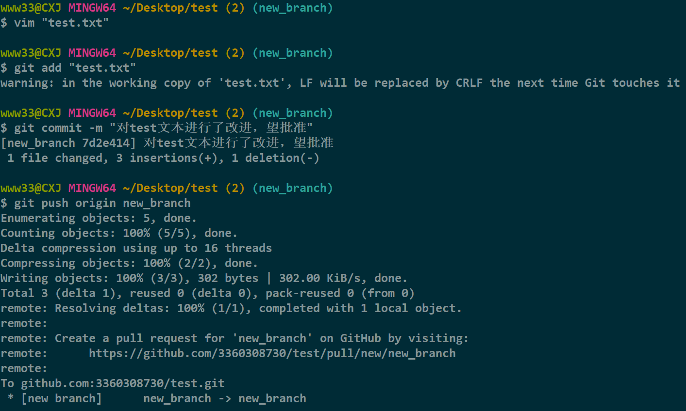

# Branch PR(需要对该仓库有写入权限)
这部分内容在团队合作中非常重要，通常是队长创建一个初始框架，队友则需要自己创建一个新分支，然后提交自己的代码，队长审核无误后，最后合并到主分支。
## 1，创建新分支并切换到该分支

```
git switch -c new_branch    // 创建并切换到新分支
```
## 2，做出相应修改，并提交到本地仓库

```
git add .
git commit -m "commit message"
git push origin new_branch  //用新分支提交远程仓库
```
## 3，在GitHub上创建一个Pull Request
### （1）当新分支推送给远程仓库后，GitHub会自动检测到有新的分支，并提示创建一个Pull Request。

### （2）我们可以看到这个新分支所做的修改

### （3）然后点击Create Pull Request，创建一个Pull Request。

### （4）没问题后，就可以点击Merge Pull Request，合并到主分支，合并后可以对该分支进行删除。

## 4，删除分支
远程仓库删除分支后，需要注意的是远程仓库的commit与本地仓库的commit并不一致，需要进行同步操作。
### （1）拉取远程仓库的commit

```
git pull origin main
```
### （2）删除本地分支


```
git switch main //先切换到主分支
git branch -d new_branch    //删除分支
```