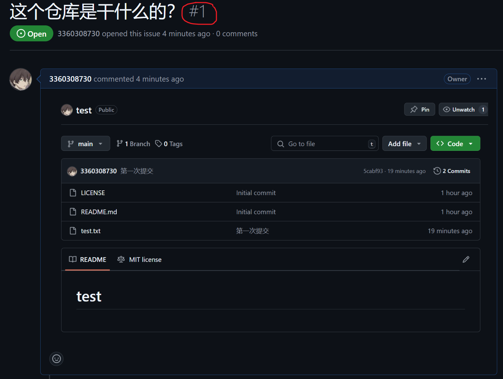
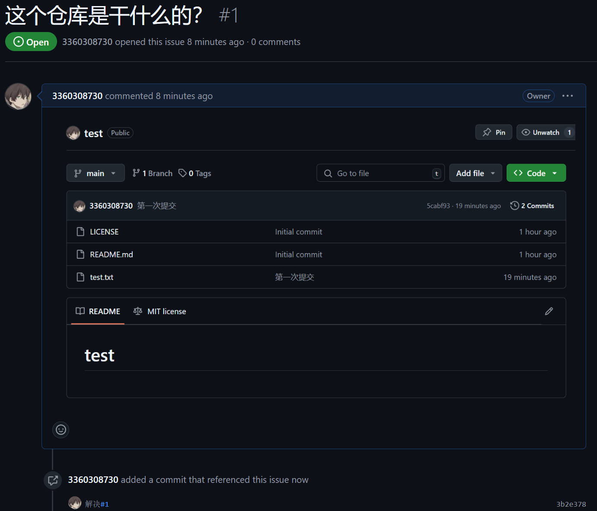
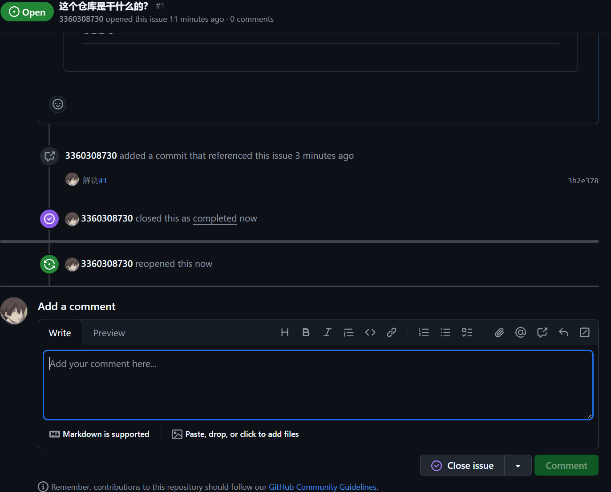

# issue
## 1，在github上创建issue

## 2，在本地仓库进行对应修改，解决issue指出的问题
```
//在本地仓库进行相应修改

git add ~
git commit -m "解决#1"   //因为图片当前issue为#1，所以commit信息为解决#1
git push origin master
```

可以看到github中相应issue的回复，并且点击回复的#1可以看到相应做出的修改
## 3，关闭issue
在完成问题解决后可以对issue进行关闭，也可以重新开启issue

