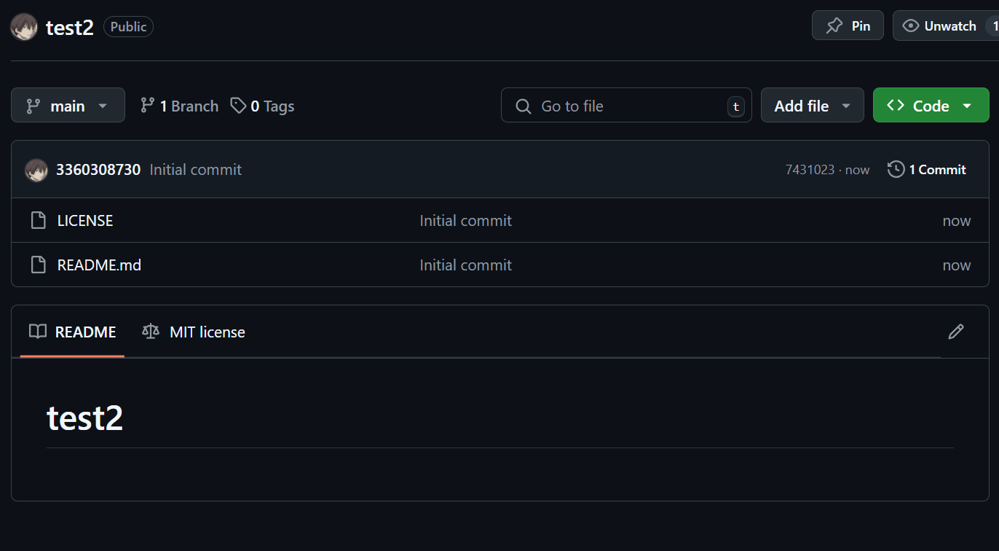

# 本地仓库已有项目推送给远程仓库
## 1.创建一个添加了readme和license的空仓库

实际上如果创建一个什么都没有的空仓库会方便很多，这里是为了熟悉更多命令
## 2.本地仓库与远程仓库相关信息保持一致
### （1）添加本地仓库的远程仓库地址
```
git remote  // 查看本地仓库的远程仓库地址(没有显示则为当前本地仓库没有添加本地仓库地址)，git remote -v 查看所有详细远程仓库地址

//本地仓库没有其他远程仓库地址，则添加远程仓库地址
git remote add origin git@github.com:3360308730/test.git   // 添加本地仓库的远程仓库地址，其中origin是远程仓库的别名，可以自定义。远程仓库地址用的是ssh，方便后续拉取代码等

//本地仓库有其他远程仓库地址，则修改远程仓库地址
git remote set-url origin git@github.com:3360308730/test.git
```
### （2）修改本地仓库分支名
```
git branch  /// 查看本地仓库分支名

git branch -M main  // 修改本地仓库分支名，默认分支名是master，这里修改为main(与远程仓库的分支名一致)
```
### （3）远程仓库文件同步
因为这里创建远程仓库时添加了readme和license，远程仓库会有一个初始化提交，然而本地仓库也有提交，会产生冲突

```
git pull origin main    // 拉取远程仓库文件到本地仓库(需要提前配置好ssh密钥)，且远程仓库地址是用的ssh

//可能会出现本地仓库和远程仓库各自都有提交的冲突情况
git pull --rebase origin main  //将本地仓库的提交设置为新的提交

git log   // 查看本地仓库提交记录
```
## 3.推送本地仓库代码到远程仓库
```
git push origin main   // 推送本地仓库代码到远程仓库，且远程仓库地址是用的ssh
```
